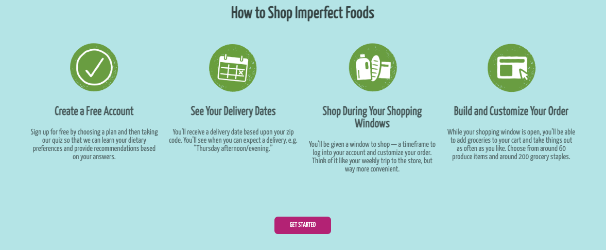

# Intro to CSS Practice

## Imperfect Foods Comp Recreation
live site https://yuji3000.github.io/css-intro-imperfectFoods/
This is a Turing School of Software and Design CSS practice for the front end program. 
I am a graduate of their back end program and working through this individually.

### Instructions
You will be recreating a piece of [this site](https://try.imperfectfoods.com/overview). Scroll down to the section titled "How to Shop Imperfect Foods."

#### The Comp:

##### My finished product:

